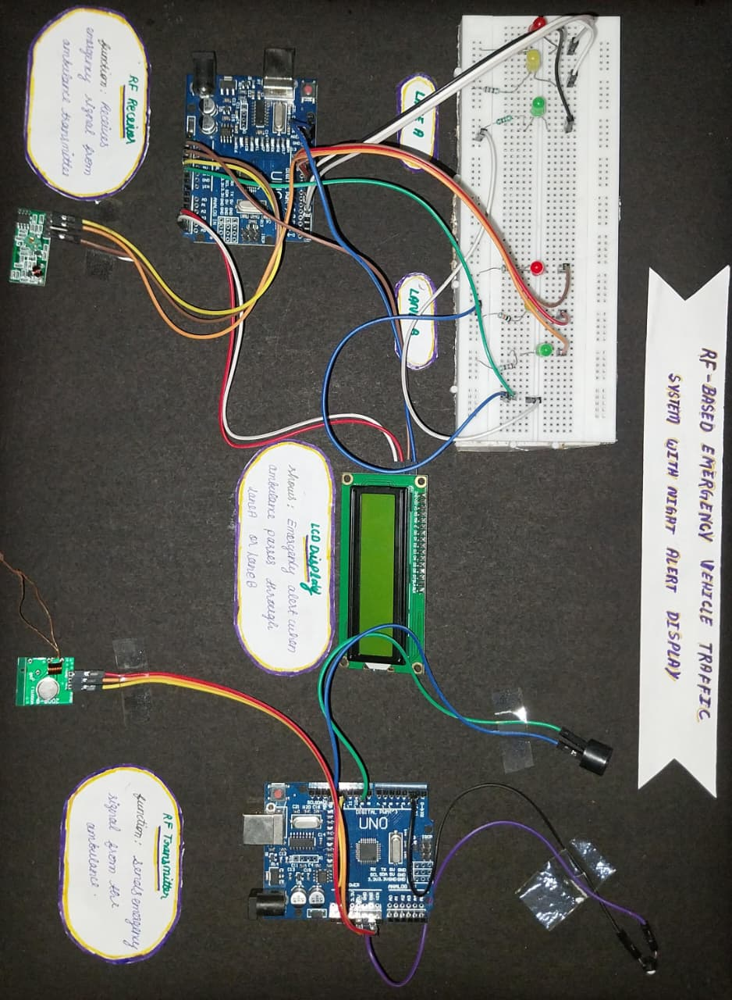

RF-Based Emergency Vehicle Traffic System with Night Alert Display

Overview

The RF-Based Emergency Vehicle Traffic System with Night Alert Display is an intelligent traffic management solution designed to provide priority access to emergency vehicles such as ambulances, fire engines, and police vehicles.

The system utilizes Radio Frequency (RF) communication to detect approaching emergency vehicles and automatically control traffic signals, ensuring a clear path and minimizing response time. Additionally, the system includes a Night Alert Display feature that enhances driver awareness and road safety during low-visibility conditions.

---

Abstract

This project presents a smart traffic control system that grants priority to emergency vehicles through RF communication. When an emergency vehicle approaches an intersection, an RF signal is transmitted to the traffic control unit. Upon receiving the signal, the system automatically changes the corresponding lane signal to GREEN while all other lanes remain RED.

To further improve safety, the system activates a buzzer and displays an emergency notification on an LCD screen. After a predefined duration, the traffic signal returns to its normal operation cycle.

---

Objective

- Develop a real-time traffic signal control system.
- Automatically grant right of way to emergency vehicles.
- Utilize wireless RF communication for emergency detection.
- Enhance road safety through a Night Alert Display mechanism.
- Reduce delays in emergency response.

---

## Screenshots

### Hardware Setup

---

Key Innovation

A distinguishing feature of this project is the integration of a Night Alert Display with emergency vehicle prioritization.

Innovative Features

- Emergency vehicle prioritization using RF communication.
- Night Alert Display for improved visibility during low-light conditions.
- LCD-based emergency notifications.
- Audible alert through buzzer activation.
- Automatic traffic signal control.
- Low-cost and scalable implementation.

The Night Alert Display improves awareness among road users during nighttime and low-visibility conditions, supporting safer and more efficient emergency vehicle movement.

---

System Architecture

Transmitter Unit (Emergency Vehicle)

- Arduino Uno
- RF Transmitter Module
- Push Button
- Power Supply

Receiver Unit (Traffic Signal Controller)

- Arduino Uno
- RF Receiver Module
- Traffic Signal LEDs
- 16x2 LCD Display
- Buzzer
- Breadboard
- Connecting Wires

---

Components Used

- Arduino Uno (2)
- RF Transmitter Module
- RF Receiver Module
- 16x2 LCD Display
- Buzzer
- LEDs (Red, Yellow and Green)
- Breadboard
- Resistors
- Jumper Wires
- USB Cable

---

Workflow

START
  ->
Normal Traffic Cycle
  ->
Check Button (TX)
  ->
Button Pressed?
  ->if YES then
Send RF Signal
  ->
Receiver Gets Signal?
  -> if YES
Activate Emergency Mode
  ->
Green for Emergency Lane
Red for Other Lanes
Buzzer ON
LCD Update
  ->
Wait Few Seconds
  ->
Return to Normal Cycle
  ->
REPEAT

---

Working Principle

- The system operates under a normal traffic signal cycle.
- The emergency vehicle activates the RF transmitter.
- An RF signal is transmitted to the receiver unit.
- The receiver detects the incoming signal.
- Emergency mode is activated.
- The emergency lane traffic signal turns GREEN.
- Signals for all other lanes turn RED.
- The buzzer generates an alert notification.
- The LCD displays an emergency vehicle warning message.
- After a predefined interval, the system automatically returns to normal operation.

---

Software Implementation

Platform

- Arduino IDE

Programming Language

- Arduino C/C++

Source Files

- transmitter.ino
- receiver.ino

---

Features

- RF-Based Emergency Vehicle Detection
- Automatic Traffic Signal Control
- Real-Time Response Mechanism
- LCD-Based Alert Notification
- Night Alert Display System
- Audible Alert Through Buzzer
- Cost-Effective Implementation
- Smart City Compatible Design

---

Applications

- Smart Traffic Management Systems
- Emergency Vehicle Prioritization
- Ambulance Traffic Clearance Systems
- Fire Engine Priority Management
- Intelligent Transportation Systems
- Smart City Infrastructure
- Urban Traffic Automation

---

Future Enhancements

- GPS-Based Emergency Vehicle Tracking
- IoT Integration and Remote Monitoring
- Multi-Intersection Traffic Coordination
- Mobile Application Notifications
- AI-Based Traffic Prediction and Optimization

---

Authors

ANUVARDHINI T 
SHALINI S
SUBALAKSHMI R
PRIYANKA S

Information Technology Students
