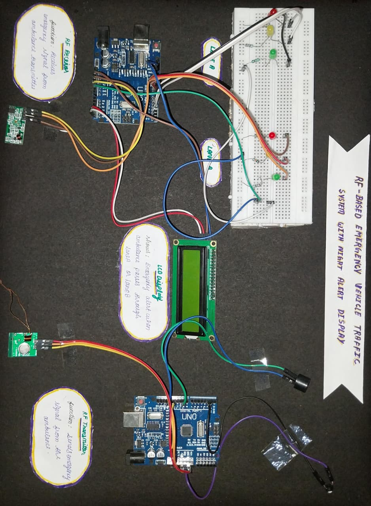

# 🚨 RF-Based Emergency Vehicle Traffic System with Night Alert Display

##      Smart Emergency Vehicle Priority & Traffic Management System

<p align="center">
  <strong>Detect • Prioritize • Alert • Control — Smarter Emergency Traffic Management</strong>
</p>

<p align="center">
  An intelligent traffic management system that uses RF communication to detect
  approaching emergency vehicles and automatically provide traffic signal
  priority while activating audible and visual alerts for improved road safety.
</p>

<p align="center">
  
  
  
  
  
</p>

---

## 📑 Table of Contents

* [🌐 About](#-about)
* [❗ Problem Statement](#-problem-statement)
* [💡 Solution](#-solution)
* [🎯 Objectives](#-objectives)
* [✨ Key Innovation](#-key-innovation)
* [🚨 Key Features](#-key-features)
* [🏗️ System Architecture](#️-system-architecture)
* [🔧 Components Used](#-components-used)
* [🔄 System Workflow](#-system-workflow)
* [⚙️ Working Principle](#️-working-principle)
* [💻 Software Implementation](#-software-implementation)
* [📸 Project Screenshots](#-project-screenshots)
* [📊 System Operation](#-system-operation)
* [🌆 Applications](#-applications)
* [🧪 Testing](#-testing)
* [🎥 Demonstration Video](#-demonstration-video)
* [🏆 Project Highlights](#-project-highlights)
* [🔮 Future Enhancements](#-future-enhancements)
* [👥 Authors](#-authors)
* [📜 License](#-license)

---

# 🌐 About

The **RF-Based Emergency Vehicle Traffic System with Night Alert Display** is an intelligent traffic management solution designed to provide priority access to emergency vehicles such as:

* 🚑 Ambulances
* 🚒 Fire Engines
* 🚓 Police Vehicles

The system uses **Radio Frequency (RF) communication** to detect an approaching emergency vehicle and automatically control the traffic signals.

When an emergency signal is received, the corresponding lane is given priority by switching its traffic signal to **GREEN**, while the remaining lanes are switched to **RED**.

The system also provides:

* 🔊 Audible alerts through a buzzer
* 📟 Emergency notifications through a 16x2 LCD
* 🌙 Night Alert Display functionality
* 🚦 Automatic traffic signal control

The objective is to minimize emergency vehicle delays and improve road safety, especially during low-visibility conditions.

---

# ❗ Problem Statement

Emergency vehicles often face significant delays at traffic intersections due to congestion and conventional traffic signal systems.

During emergencies, every second can be important. A conventional traffic signal cannot automatically identify an approaching ambulance, fire engine, or police vehicle and provide it with immediate right of way.

This creates challenges such as:

* 🚑 Delayed emergency vehicle movement
* 🚦 Traffic congestion
* ⚠️ Difficulty identifying emergency situations
* 🌙 Reduced visibility during nighttime
* 🔊 Lack of immediate warning to nearby road users

A smart system is therefore required to detect emergency vehicles and automatically prioritize their movement.

---

# 💡 Solution

The proposed system uses **RF-based wireless communication** to provide emergency vehicle priority.

```text
                    Emergency Vehicle
                           │
                           ▼
                    ┌─────────────┐
                    │   Button    │
                    └──────┬──────┘
                           │
                           ▼
                    ┌─────────────┐
                    │   Arduino   │
                    │     TX      │
                    └──────┬──────┘
                           │
                           │ RF Signal
                           ▼
                    ┌─────────────┐
                    │ RF Receiver │
                    └──────┬──────┘
                           │
                           ▼
                    ┌─────────────┐
                    │   Arduino   │
                    │     RX      │
                    └──────┬──────┘
                           │
              ┌────────────┼────────────┐
              ▼            ▼            ▼
          Traffic LED     LCD         Buzzer
              │            │            │
              ▼            ▼            ▼
        Emergency      Emergency      Audible
          GREEN          Alert         Alert
```

When an emergency vehicle sends the RF signal, the receiver activates emergency mode.

The system then:

1. Provides a green signal to the emergency lane.
2. Turns other lanes red.
3. Activates the buzzer.
4. Displays an emergency notification on the LCD.
5. Maintains emergency mode for a predefined duration.
6. Returns to the normal traffic cycle.

---

# 🎯 Objectives

The main objectives of the project are:

* 🚦 Develop a real-time traffic signal control system.
* 🚑 Automatically provide right of way to emergency vehicles.
* 📡 Utilize wireless RF communication for emergency detection.
* 🌙 Improve road safety using a Night Alert Display mechanism.
* 📟 Display emergency notifications through an LCD.
* 🔊 Provide audible alerts using a buzzer.
* ⏱️ Reduce delays in emergency vehicle response.
* 💰 Develop a low-cost and scalable solution.

---

# ✨ Key Innovation

A distinguishing feature of this project is the integration of **Night Alert Display** with emergency vehicle prioritization.

The system does not only change traffic signals but also provides visual and audible warnings to improve awareness among road users.

## Innovative Features

| Feature                     | Purpose                                                |
| --------------------------- | ------------------------------------------------------ |
| 📡 RF Communication         | Wireless emergency vehicle detection                   |
| 🚑 Emergency Priority       | Provides right of way to emergency vehicles            |
| 🚦 Automatic Signal Control | Controls traffic LEDs automatically                    |
| 🌙 Night Alert Display      | Improves visibility during low-light conditions        |
| 📟 LCD Notification         | Displays emergency warnings                            |
| 🔊 Buzzer Alert             | Provides audible notification                          |
| 💰 Low-Cost Design          | Uses affordable hardware components                    |
| 🌆 Smart City Compatibility | Can be extended for intelligent transportation systems |

---

# 🚨 Key Features

## 📡 RF-Based Emergency Detection

The emergency vehicle is equipped with an RF transmitter.

When the emergency signal is activated, the transmitter sends a wireless signal to the traffic controller.

---

## 🚦 Automatic Traffic Signal Control

When an emergency signal is detected:

```text
Emergency Lane  → 🟢 GREEN
Other Lanes     → 🔴 RED
```

This creates a clear path for the emergency vehicle.

---

## 📟 LCD Emergency Notification

The 16x2 LCD displays an emergency notification when emergency mode is activated.

Example:

```text
EMERGENCY VEHICLE
     PRIORITY
```

This provides a visual indication to nearby road users.

---

## 🔊 Audible Emergency Alert

A buzzer is activated when emergency mode begins.

The audible alert helps attract the attention of road users.

---

## 🌙 Night Alert Display

The Night Alert Display feature improves awareness during nighttime and low-visibility conditions.

It works together with the LCD and alert mechanism to notify road users about an approaching emergency vehicle.

---

## 🔄 Automatic Recovery

After a predefined duration, the system automatically exits emergency mode and returns to the normal traffic signal cycle.

---

# 🏗️ System Architecture

The system consists of two major units:

## 📡 Transmitter Unit — Emergency Vehicle

Components:

* Arduino Uno
* RF Transmitter Module
* Push Button
* Power Supply

```text
             Emergency Vehicle
                    │
                    ▼
              Push Button
                    │
                    ▼
              Arduino Uno
                    │
                    ▼
           RF Transmitter
                    │
                    │ Wireless Signal
                    ▼
             Traffic Junction
```

---

## 🚦 Receiver Unit — Traffic Signal Controller

Components:

* Arduino Uno
* RF Receiver Module
* Traffic Signal LEDs
* 16x2 LCD Display
* Buzzer
* Breadboard
* Connecting Wires

```text
                 RF Signal
                     │
                     ▼
              RF Receiver
                     │
                     ▼
                Arduino
                     │
       ┌─────────────┼─────────────┐
       │             │             │
       ▼             ▼             ▼
 Traffic LEDs      LCD          Buzzer
       │             │             │
       ▼             ▼             ▼
 Signal Control   Message       Alert
```

---

# 🔧 Components Used

| Component             |    Quantity | Purpose                          |
| --------------------- | ----------: | -------------------------------- |
| Arduino Uno           |           2 | Transmitter and receiver control |
| RF Transmitter Module |           1 | Sends emergency signal           |
| RF Receiver Module    |           1 | Receives emergency signal        |
| 16x2 LCD Display      |           1 | Emergency notification           |
| Buzzer                |           1 | Audible alert                    |
| Red LEDs              | As required | Traffic signal                   |
| Yellow LEDs           | As required | Traffic signal                   |
| Green LEDs            | As required | Traffic signal                   |
| Breadboard            | As required | Circuit assembly                 |
| Resistors             | As required | Current limiting                 |
| Jumper Wires          | As required | Circuit connections              |
| USB Cable             | As required | Arduino programming/power        |

---

# 🔄 System Workflow

```text
                         START
                           │
                           ▼
                 Normal Traffic Cycle
                           │
                           ▼
                    Check Button
                     on Transmitter
                           │
                           ▼
                    Button Pressed?
                     /          \
                   NO            YES
                   │              │
                   │              ▼
                   │        Send RF Signal
                   │              │
                   │              ▼
                   │      Receiver Gets Signal?
                   │          /         \
                   │        NO           YES
                   │        │             │
                   │        │             ▼
                   │        │      Activate Emergency
                   │        │             Mode
                   │        │             │
                   │        │     ┌───────┼────────┐
                   │        │     ▼       ▼        ▼
                   │        │   Green    Red     Buzzer
                   │        │   Emergency Other     ON
                   │        │    Lane     Lanes
                   │        │             │
                   │        │             ▼
                   │        │            LCD
                   │        │          Update
                   │        │             │
                   │        │             ▼
                   │        │       Wait Few Seconds
                   │        │             │
                   └────────┴─────────────┤
                                          ▼
                                 Return to Normal
                                  Traffic Cycle
                                          │
                                          ▼
                                        REPEAT
```

---

# ⚙️ Working Principle

The system operates according to the following sequence:

### 1. Normal Traffic Operation

The traffic signals operate under their normal cycle.

### 2. Emergency Vehicle Activation

The emergency vehicle activates the push button connected to the RF transmitter.

### 3. RF Signal Transmission

The transmitter Arduino sends an emergency signal through the RF transmitter module.

### 4. Signal Reception

The RF receiver installed at the traffic control unit receives the signal.

### 5. Emergency Mode

The receiver Arduino identifies the emergency signal and activates emergency mode.

### 6. Traffic Priority

The traffic signal for the emergency vehicle's lane becomes:

```text
🟢 GREEN
```

Other traffic lanes become:

```text
🔴 RED
```

### 7. Audible Alert

The buzzer is activated to notify nearby road users.

### 8. LCD Alert

The LCD displays an emergency vehicle warning.

### 9. Night Alert

The Night Alert Display mechanism improves awareness during nighttime and low-visibility conditions.

### 10. Return to Normal

After the predefined interval, emergency mode ends and the normal traffic cycle resumes.

---

# 💻 Software Implementation

## Platform

**Arduino IDE**

## Programming Language

**Arduino C/C++**

## Source Files

```text
transmitter.ino
receiver.ino
```

### Transmitter Program

The transmitter program is responsible for:

* Monitoring the push button.
* Detecting emergency activation.
* Sending the RF signal.

```text
Push Button
     │
     ▼
Arduino Uno
     │
     ▼
RF Transmitter
     │
     ▼
Emergency Signal
```

### Receiver Program

The receiver program is responsible for:

* Receiving the RF signal.
* Activating emergency mode.
* Controlling traffic LEDs.
* Activating the buzzer.
* Updating the LCD.
* Returning to normal traffic operation.

```text
RF Receiver
     │
     ▼
Arduino Uno
     │
 ┌───┼──────────────┐
 ▼   ▼              ▼
LED LCD           Buzzer
Control Alert      Alert
```

---

# 📸 Project Screenshots

## 🔧 Hardware Setup



The hardware setup demonstrates the transmitter and receiver units, traffic signal LEDs, LCD display, buzzer, and associated circuit connections.

---

# 📊 System Operation

The system can be represented through three primary operating states.

## 🟢 Normal Mode

```text
Traffic Signals
      │
      ▼
Normal Cycle
      │
      ▼
Monitor RF Receiver
```

---

## 🚨 Emergency Mode

```text
RF Emergency Signal
        │
        ▼
Emergency Detection
        │
        ▼
Emergency Lane → GREEN
Other Lanes    → RED
        │
   ┌────┴────┐
   ▼         ▼
  LCD      Buzzer
 Alert      ON
```

---

## 🔄 Recovery Mode

```text
Emergency Timer
      │
      ▼
Predefined Duration
      │
      ▼
Emergency Mode OFF
      │
      ▼
Normal Traffic Cycle
```

---

# 🌆 Applications

The system can be applied to:

* 🚦 Smart Traffic Management Systems
* 🚑 Emergency Vehicle Prioritization
* 🚑 Ambulance Traffic Clearance Systems
* 🚒 Fire Engine Priority Management
* 🚓 Police Vehicle Priority Systems
* 🛣️ Intelligent Transportation Systems
* 🌆 Smart City Infrastructure
* 🏙️ Urban Traffic Automation

---

# 🧪 Testing

## Test 1 — Normal Traffic Operation

**Input:** No emergency signal.

**Expected Result:**

The traffic lights continue their normal cycle.

---

## Test 2 — Emergency Signal Transmission

**Input:** Press the transmitter push button.

**Expected Result:**

The RF transmitter sends an emergency signal.

---

## Test 3 — Emergency Signal Reception

**Input:** RF signal received by the receiver.

**Expected Result:**

The receiver activates emergency mode.

---

## Test 4 — Emergency Traffic Priority

**Input:** Emergency mode activated.

**Expected Result:**

```text
Emergency Lane → GREEN
Other Lanes    → RED
```

---

## Test 5 — LCD Alert

**Input:** Emergency signal received.

**Expected Result:**

The LCD displays an emergency vehicle notification.

---

## Test 6 — Buzzer Alert

**Input:** Emergency mode activated.

**Expected Result:**

The buzzer turns ON to provide an audible warning.

---

## Test 7 — Automatic Recovery

**Input:** Emergency mode remains active for the predefined duration.

**Expected Result:**

The system automatically returns to the normal traffic cycle.

---

# 🎥 Demonstration Video

## Project Demo

The complete hardware demonstration is available here:

**[▶️ View Project Demo](hardware_demo.mp4)**

The demonstration showcases:

* RF signal transmission
* RF signal reception
* Emergency mode activation
* Traffic signal control
* LCD emergency notification
* Buzzer alert
* Night Alert Display functionality

---

# 🏆 Project Highlights

| Area                      | Implementation                   |
| ------------------------- | -------------------------------- |
| 🚑 Emergency Detection    | RF Communication                 |
| 📡 Wireless Communication | RF Transmitter & Receiver        |
| 🚦 Traffic Management     | Arduino-controlled LEDs          |
| 📟 Visual Alert           | 16x2 LCD                         |
| 🔊 Audible Alert          | Buzzer                           |
| 🌙 Night Safety           | Night Alert Display              |
| ⚡ Response                | Real-time emergency activation   |
| 💰 Cost                   | Low-cost hardware implementation |
| 🌆 Deployment             | Smart City compatible            |

---

# 🔮 Future Enhancements

The system can be extended with advanced technologies such as:

### 📍 GPS-Based Emergency Vehicle Tracking

GPS can be integrated to determine the real-time location of emergency vehicles and automatically identify the approaching intersection.

### ☁️ IoT Integration

The traffic controller can be connected to an IoT platform for:

* Remote monitoring
* Traffic data collection
* System status monitoring
* Emergency event logging

### 🚦 Multi-Intersection Coordination

Multiple traffic junctions can communicate with each other to create a continuous green corridor for emergency vehicles.

```text
Emergency Vehicle
       │
       ▼
Intersection 1
       │
       ▼
Intersection 2
       │
       ▼
Intersection 3
       │
       ▼
Destination
```

### 📱 Mobile Application

A mobile application can provide emergency notifications and system monitoring.

### 🤖 AI-Based Traffic Prediction

AI can analyze traffic conditions and dynamically optimize traffic signals based on:

* Traffic density
* Emergency vehicle location
* Road conditions
* Historical traffic patterns

---

# 👥 Authors

This project was developed by:

| # | Author            |
| - | ----------------- |
| 1 | **ANUVARDHINI T** |
| 2 | **SHALINI S**     |
| 3 | **SUBALAKSHMI R** |
| 4 | **PRIYANKA S**    |

**Information Technology Students**

---

# 📜 License

This project is developed for **educational, academic, and demonstration purposes**.

The project demonstrates the practical application of Arduino, RF communication, traffic signal automation, and alert systems.

---

<p align="center">
  <strong>🚨 RF-Based Emergency Vehicle Traffic System</strong>
</p>

<p align="center">
  Detect • Prioritize • Alert • Control
</p>

<p align="center">
  <em>Smart traffic management for faster and safer emergency response.</em>
</p>
